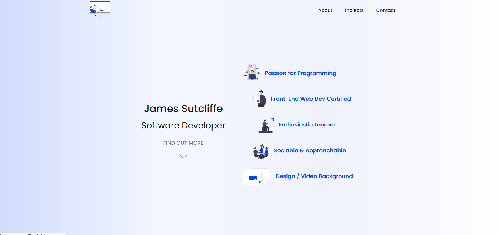
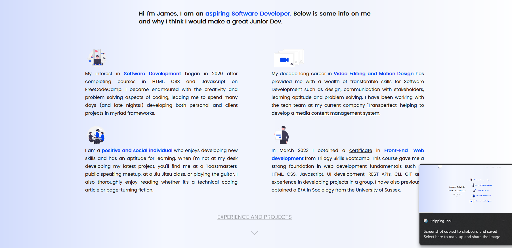
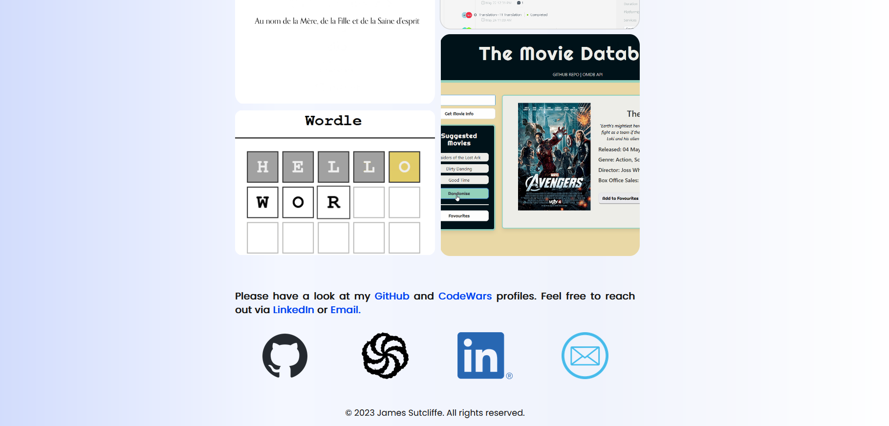

  

# js-portfolio

# James Sutcliffe Software Developer Portfolio

A portfolio designed and developed to allow users to get to know me and my software development journey.

## Description

The portfolio was developed using HTML, CSS and Javascript. There are four main sections: home, about, projects and contact. The portfolio is single page and responsive to screen size. The layout of the portfolio utilises both CSS Grid and Flexbox, with links to project displayed in modals triggered by javascript interactivity.

## Deployment

The site is deployed on GitHub pages:

https://jamesrobertsutcliffe.github.io/js-portfolio/

## Acknowledgments

 - https://undraw.co/ provided open source illustrations which were utilised throughout this portfolio.